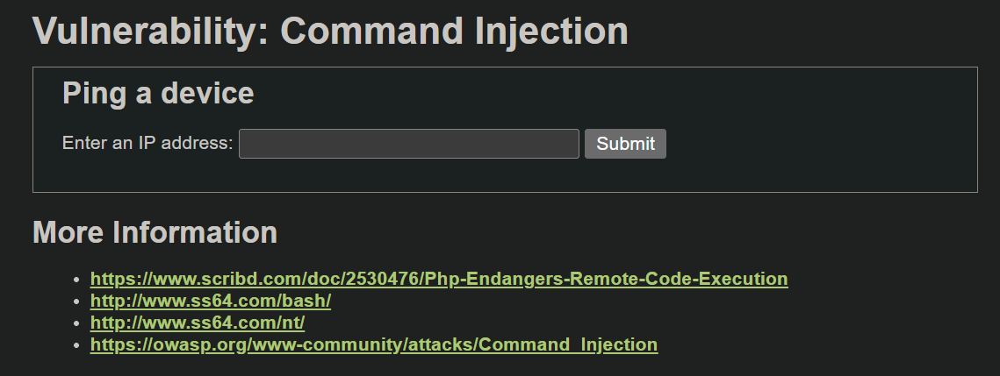
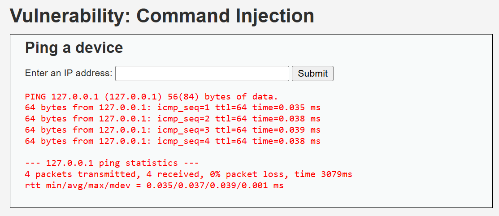
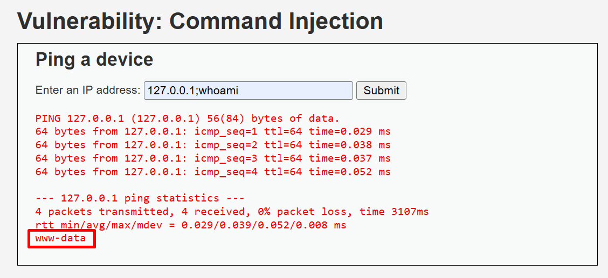
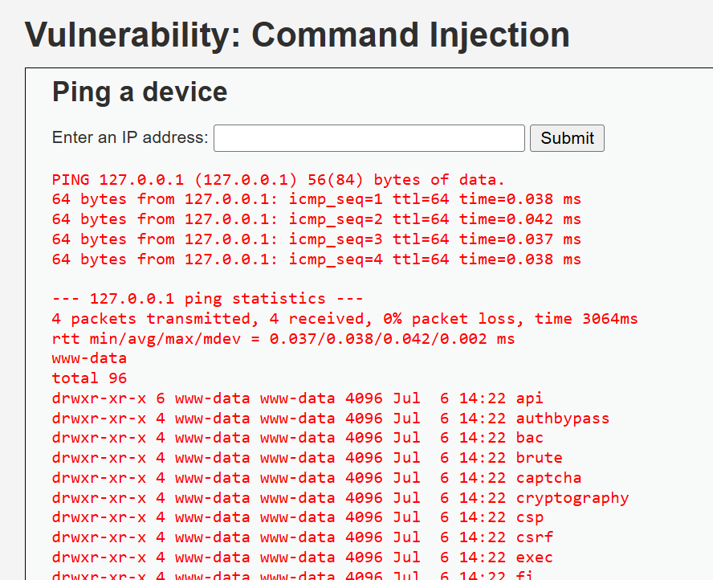
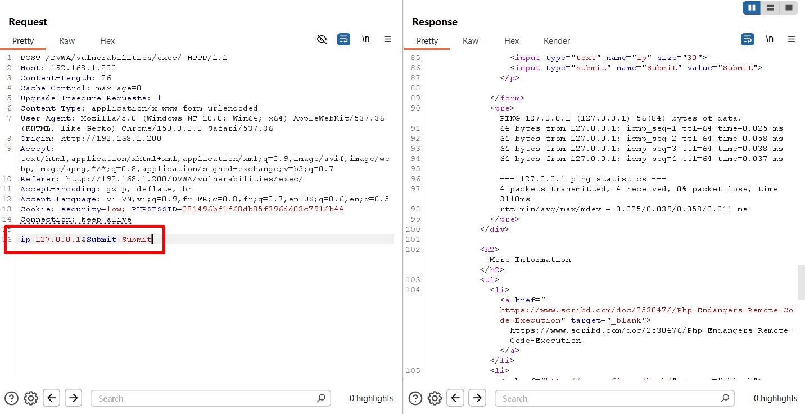
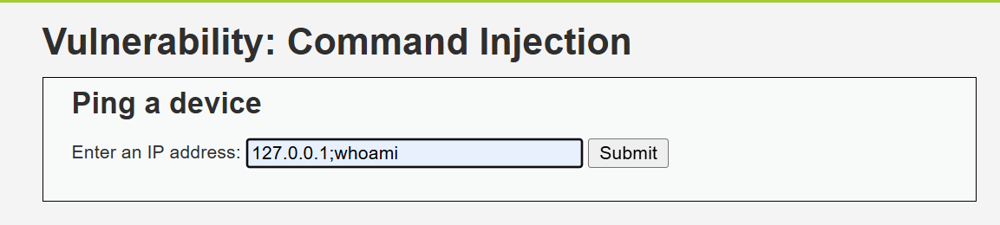
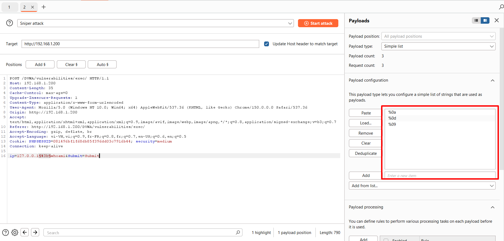
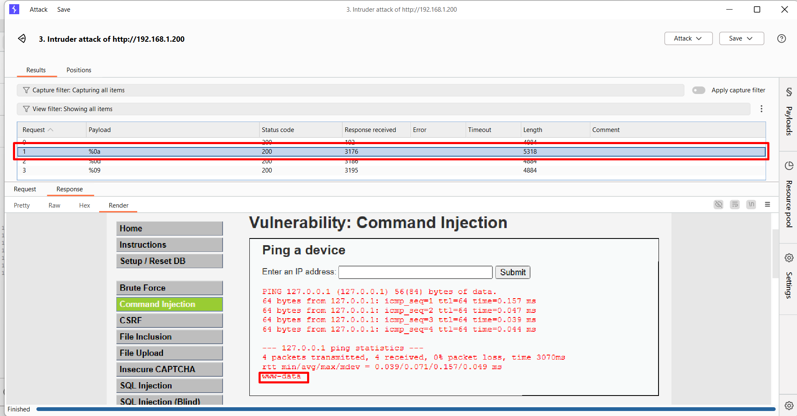
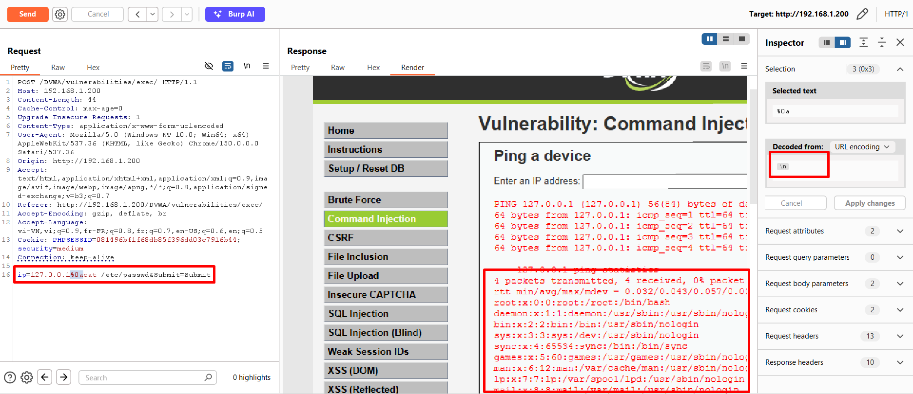

# **Command Injection**
## **Tổng quan**

Command Injection là lỗ hổng cho phép kẻ tấn công chèn và thực thi các **lệnh hệ điều hành (OS commands)** thông qua dữ liệu đầu vào của ứng dụng.

Lỗ hổng này thường xuất hiện khi ứng dụng:

* Nhận dữ liệu trực tiếp từ người dùng.
* Ghép dữ liệu đó vào câu lệnh hệ thống.
* Không kiểm tra hoặc lọc các ký tự đặc biệt.
* Sử dụng các hàm thực thi lệnh như `system()`, `exec()`, `shell_exec()` hoặc `passthru()`.
* Chạy ứng dụng với quyền hệ thống quá cao.

Kẻ tấn công có thể sử dụng các toán tử nối lệnh như `&&`, `;`, `|` hoặc `||` để thực thi thêm các lệnh ngoài chức năng ban đầu của ứng dụng.

Trong DVWA, mục tiêu của bài lab là phân tích chức năng kiểm tra địa chỉ IP, sau đó chèn thêm lệnh hệ điều hành vào dữ liệu đầu vào. Ở mỗi mức bảo mật **Low, Medium, High và Impossible**, ứng dụng sẽ bổ sung các cơ chế kiểm tra, lọc hoặc xác thực dữ liệu nhằm hạn chế và ngăn chặn Command Injection.

## **Security Level**
### **Low**
#### **Cách khai thác**


Khi truy cập, ta thấy web có chức năng ping cho phép gửi bản tin ping đến 1 IP bất kì



Khi ta thử ping địa chỉ localhost của máy chủ, thấy nó trả về kết quả của lệnh ping 



Khi ta thêm `;` kết thúc lệnh và thêm vào 1 câu lệnh hệ điều hành `whoami` dùng để kiểm tra tên người dùng hiện tại thì ta thấy hệ thống đã thực hiện và in ra kết quả tên người dùng là `www-data` 



Sau thêm một vài câu lệnh, ta có thể thấy được bất kì câu lệnh nào của hệ điều hành đều có thể thực hiện được (với đúng quyền của user `www-data`)

#### **Phân tích mã nguồn**
```php

<?php

if( isset( $_POST[ 'Submit' ]  ) ) {
    // Get input
    $target = $_REQUEST[ 'ip' ];

    // Determine OS and execute the ping command.
    if( stristr( php_uname( 's' ), 'Windows NT' ) ) {
        // Windows
        $cmd = shell_exec( 'ping  ' . $target );
    }
    else {
        // *nix
        $cmd = shell_exec( 'ping  -c 4 ' . $target );
    }

    // Feedback for the end user
    echo "<pre>{$cmd}</pre>";
}

?>
```



Ta có thể nhìn thấy được request được gửi lên bằng method `POST`\
Phần thân gồm 2 tham số gồm `ip` và `Submit`

```php
isset( $_POST[ 'Submit' ]  )
```

Ban đầu, web lấy và kiểm tra tham số `Submit`, nếu có thì tiếp tục thực hiện khối lệnh bên dưới 

Tiếp theo sẽ xác định hệ điều hành của web, nếu `php_uname( 's' )` trả ra kết quả liên quan đến Window thì sẽ thực thi lệnh Ping của **Window**, nếu không thì ở đây mặc định là **Linux**, vì vậy cần phải thêm tham số `-c 4` để chỉ ping `4` lần 

```php
$cmd = shell_exec( 'ping  ' . $target ) #Window
$cmd = shell_exec( 'ping  -c 4 ' . $target ) #Linux
```

> Dấu `.` là toán tử nối chuỗi

Đây chính là nguyên nhân chính dẫn đến lỗ hổng\
Code đã dùng hàm `shell_exec()` để thực thi câu lệnh của hệ điều hành rồi lưu kết quả vào biến `$cmd`\
Sai lầm ở đây là code đã truyền thẳng input của người dùng vào hàm mà không có bất kì escape hay cơ chế phát hiện lệnh hệ điều hành nào

Ví dụ: Khi ta nhập IP `127.0.0.1` vào, câu lệnh được hàm shell_exec() thực hiện đó chính là `ping 127.0.0.1`\
Nhưng khi ta nhập `127.0.0.1;whoami`, câu lệnh được thực thi trở thành `ping 127.0.0.1;whoami`\
Do đó ngoài kết quả của lện `ping`, ta còn thấy được kết quả của lệnh `whoami`

--> Từ việc thực thi trực tiếp câu lệnh hệ điều hành và không verify input của người dùng, web đã bị tiêm câu lệnh hệ điều hành và thực hiện những hành vi không mong muốn

### **Medium**
#### **Cách khai thác**


Trong level này, khi nhập các kí tự phân cách câu lệnh trong CLI thì hầu như không hoạt động (`;` `&&` `&` `||`  `$()`)\
Nó không trả về gì nghĩa là dưới backend đã thực hiện lọc 1 các kí tự này

Ta thử 1 số kí tự ít dùng hơn những kí tự trên:
- `%0a`: xuống dòng
- `%0d`: carriage return
- `%09`: tab



Ta đưa request sang Intruder thực hiện thử những kí tự trên



Ở request với tham số `%0a` ta thấy được web đã xử lý câu lệnh và trả về kết quả của câu lệnh `whoami`

#### **Phân tích mã nguồn**
```php

<?php

if( isset( $_POST[ 'Submit' ]  ) ) {
    // Get input
    $target = $_REQUEST[ 'ip' ];

    // Set blacklist
    $substitutions = array(
        '&&' => '',
        ';'  => '',
    );

    // Remove any of the characters in the array (blacklist).
    $target = str_replace( array_keys( $substitutions ), $substitutions, $target );

    // Determine OS and execute the ping command.
    if( stristr( php_uname( 's' ), 'Windows NT' ) ) {
        // Windows
        $cmd = shell_exec( 'ping  ' . $target );
    }
    else {
        // *nix
        $cmd = shell_exec( 'ping  -c 4 ' . $target );
    }

    // Feedback for the end user
    echo "<pre>{$cmd}</pre>";
}

?>
```

Ở đây ta thấy được code đã thêm blacklist gồm kí tự `;` và `&&` 

```php
$substitutions = array(
        '&&' => '',
        ';'  => '',
    );
```

Đây là 1 mảng kết hợp chứa các kí tự nên chặn và giá trị của nó

```php
$target = str_replace( array_keys( $substitutions ), $substitutions, $target )
```

Sau đó code sử dụng hàm `str_replace()` để lấy tất cả key trong mảng `substitutions` và thay thế nó bằng giá trị tương ứng của nó

Vì vậy, khi ta nhập chuỗi có kí tự `&&` hoặc `;` nó tự động chuyển thành kí tự rỗng dẫn đến lỗi câu lệnh và không trả về kết quả nào\
VD: `127.0.0.1;whoami` --> `127.0.0.1whoami` 
 
Và khi ta nhập kí tự `%0a`, nó không tồn tại trong blacklist nên câu lệnh vẫn được thực thi như bình thường

## **High**
#### **Cách khai thác**


Với level High, khi nhập kí tự %0a thì trang web vẫn bị tiêm lệnh 

#### **Phân tích mã nguồn**
```php

<?php

if( isset( $_POST[ 'Submit' ]  ) ) {
    // Get input
    $target = trim($_REQUEST[ 'ip' ]);

    // Set blacklist
    $substitutions = array(
        '||' => '',
        '&'  => '',
        ';'  => '',
        '| ' => '',
        '-'  => '',
        '$'  => '',
        '('  => '',
        ')'  => '',
        '`'  => '',
    );

    // Remove any of the characters in the array (blacklist).
    $target = str_replace( array_keys( $substitutions ), $substitutions, $target );

    // Determine OS and execute the ping command.
    if( stristr( php_uname( 's' ), 'Windows NT' ) ) {
        // Windows
        $cmd = shell_exec( 'ping  ' . $target );
    }
    else {
        // *nix
        $cmd = shell_exec( 'ping  -c 4 ' . $target );
    }

    // Feedback for the end user
    echo "<pre>{$cmd}</pre>";
}

?>
```

Ta thấy code vẫn sử dụng blacklist để lọc, nhưng cũng chỉ lọc được một số câu lệnh, vẫn bỏ sót một vài kí tự như `%0a`

## **Impossible**
```php
<?php

if( isset( $_POST[ 'Submit' ]  ) ) {
    // Check Anti-CSRF token
    checkToken( $_REQUEST[ 'user_token' ], $_SESSION[ 'session_token' ], 'index.php' );

    // Get input
    $target = $_REQUEST[ 'ip' ];
    $target = stripslashes( $target );

    // Split the IP into 4 octects
    $octet = explode( ".", $target );

    // Check IF each octet is an integer
    if( ( is_numeric( $octet[0] ) ) && ( is_numeric( $octet[1] ) ) && ( is_numeric( $octet[2] ) ) && ( is_numeric( $octet[3] ) ) && ( sizeof( $octet ) == 4 ) ) {
        // If all 4 octets are int's put the IP back together.
        $target = $octet[0] . '.' . $octet[1] . '.' . $octet[2] . '.' . $octet[3];

        // Determine OS and execute the ping command.
        if( stristr( php_uname( 's' ), 'Windows NT' ) ) {
            // Windows
            $cmd = shell_exec( 'ping  ' . $target );
        }
        else {
            // *nix
            $cmd = shell_exec( 'ping  -c 4 ' . $target );
        }

        // Feedback for the end user
        echo "<pre>{$cmd}</pre>";
    }
    else {
        // Ops. Let the user name theres a mistake
        echo '<pre>ERROR: You have entered an invalid IP.</pre>';
    }
}

// Generate Anti-CSRF token
generateSessionToken();

?>
```

Phần này code đã không dùng blacklist, thay vào đó là kiểm tra tính hợp lệ của IP trước khi thực thi câu lệnh `ping`

Code đã tách IP ra thành từng `octet`: `$octet = explode( ".", $target )`\
Sau đó kiểm tra từng octet có phải là số nguyên hay không bằng `is_numeric()`\
Sau đó lại ghép từng octet lại thành IPv4\
Hàm `escapeshellarg()` ngăn dữ liệu được shell hiểu như cú pháp

## **Cách phòng chống**
- Không dùng các hàm thực thi câu lệnh hệ điều hành trực tiếp như shell_exec(),  system(), exec(), passthru(), popen(), proc_open()
- Nếu bắt buộc phải dùng đến câu lệnh hệ điều hành thì không nên nối trực tiếp input vào câu lệnh rồi thực thi
- Sử dụng whitelist thay vì blacklist bởi vì blacklist dễ bỏ sót một số kí tự ít dùng
- Không nên cho user `www-data` chạy với quyền cao


