# **Blind SQL injection**
## **Tổng quan**

SQL Injection (SQLi) là lỗ hổng cho phép kẻ tấn công chèn và thực thi các **câu lệnh SQL độc hại** thông qua dữ liệu đầu vào của ứng dụng.

Lỗ hổng này thường xuất hiện khi ứng dụng:

* Nhận dữ liệu trực tiếp từ người dùng.
* Ghép dữ liệu đó vào câu truy vấn SQL.
* Không kiểm tra hoặc xác thực dữ liệu đầu vào.
* Không sử dụng **Prepared Statement** hoặc **Parameterized Query**.
* Hiển thị thông báo lỗi cơ sở dữ liệu quá chi tiết.
* Kết nối cơ sở dữ liệu bằng tài khoản có quyền quá cao.

Kẻ tấn công có thể sử dụng các ký tự và từ khóa SQL như `'`, `"`, `--`, `OR`, `AND`, `UNION SELECT` hoặc các truy vấn con để thay đổi logic của câu truy vấn ban đầu.

Thông qua SQL Injection, kẻ tấn công có thể vượt qua chức năng đăng nhập, đọc dữ liệu nhạy cảm, xác định cấu trúc cơ sở dữ liệu, thêm, sửa hoặc xóa dữ liệu. Trong một số trường hợp nghiêm trọng, lỗ hổng còn có thể dẫn đến việc chiếm quyền kiểm soát cơ sở dữ liệu hoặc máy chủ.

Trong DVWA, mục tiêu của bài lab là phân tích chức năng truy vấn thông tin người dùng, sau đó chèn thêm câu lệnh SQL vào dữ liệu đầu vào. Ở mỗi mức bảo mật **Low, Medium, High và Impossible**, ứng dụng sẽ bổ sung các cơ chế kiểm tra, lọc, xác thực dữ liệu hoặc sử dụng truy vấn tham số hóa nhằm hạn chế và ngăn chặn SQL Injection.

## **Security Level**
### **Low**
#### **Cách khai thác**
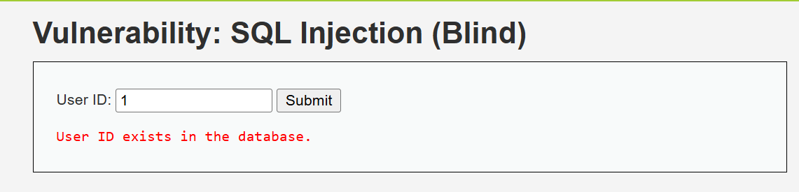

- Web cho ta một form tìm kiếm người dùng, nhưng thay vì hiển thị thông tin của người dùng thì nó chỉ báo có tồn tại hoặc không tồn tại người dùng đó
- Khi ta tra ID 1 thì ta thấy có tồn tại trong DB nên báo `User ID exists in the database.`

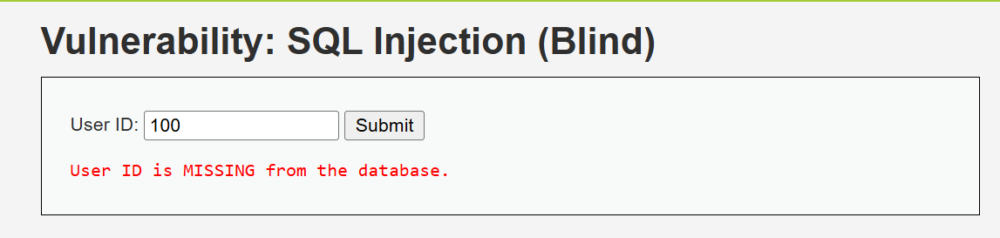

- Khi tìm kiếm ID của một người dùng không có trong hệ thống, nó sẽ báo `User ID is MISSING from the database.`

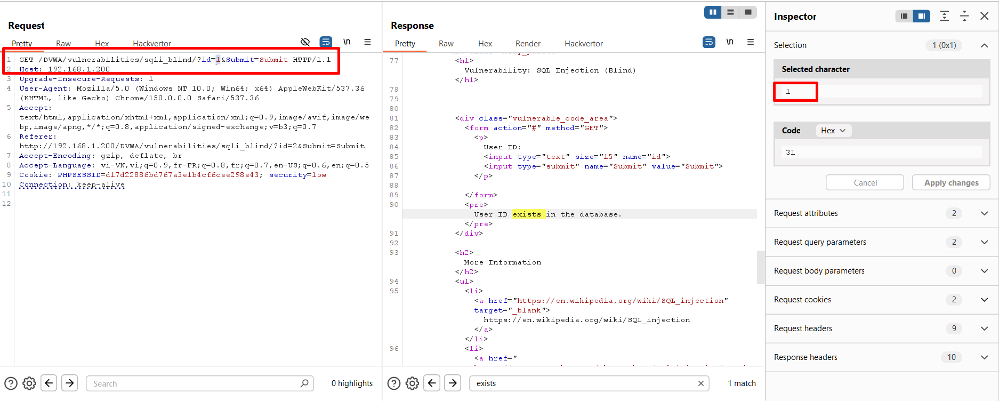

- Quan sát request trong Burp Suite, ta thấy được request được gửi đi bằng method `GET` với tham số là `id`

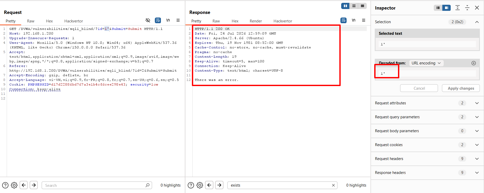

- Ta thực hiện chèn thêm dấu `'` và payload, ta thấy được rằng dù trả về status code `200` nhưng nội dung trả về là `There was an error.`

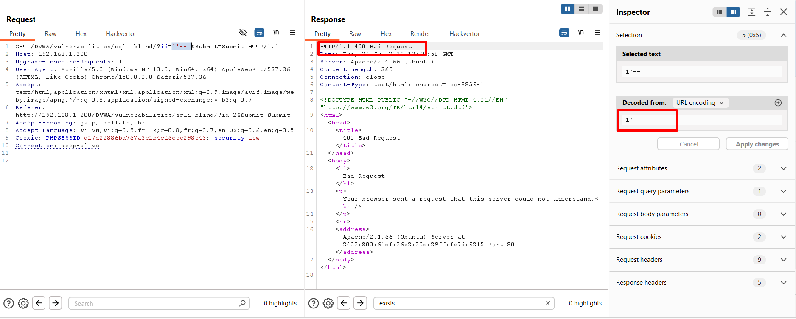

- Thêm dấu `-- `, web lại trả về `400`, điều đó chứng tỏ có lỗi trong payload của chúng ta

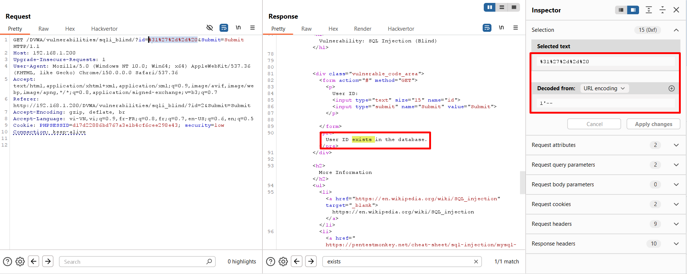

- Khi thực hiện encode giá trị của tham số `id` sang dạng URL, dữ liệu được trả về bình thường
- Vậy từ đó ta có thể kết luận được có 2 trường hợp
    - Nếu request của ta có syntax đúng với SQL, nó sẽ trả về 2 trườn hợp: nếu ID có trong DB, nó sẽ trả lại `User ID exists in the database.` (`200`), nếu không có sẽ là `User ID is MISSING from the database.` (`404`)
    - Nếu request của ta sai syntax, nó sẽ trả về `There was an error.`

--> Từ đó ta có thể biết được khi nào câu lệnh của ta đúng/sai; khi nào mệnh đề của ta đúng/sai
- Vậy luồng khai thác sẽ là: tìm ra số tên DB --> tìm ra bảng chứa username/password --> lấy username/password
- Đầu tiên ta cần xác định payload hoạt động thế nào khi ta chèn thêm chuỗi truy vấn SQL
- Ta kiểm tra điều đó theo logic: tên của DB chắc chắn có độ dài lớn hơn 0, vậy nên ta sẽ kiểm tra xem có sự khác biệt nào khi truyền vào trường hợp `>0` (*Đúng*) và `<0`(*Sai*)

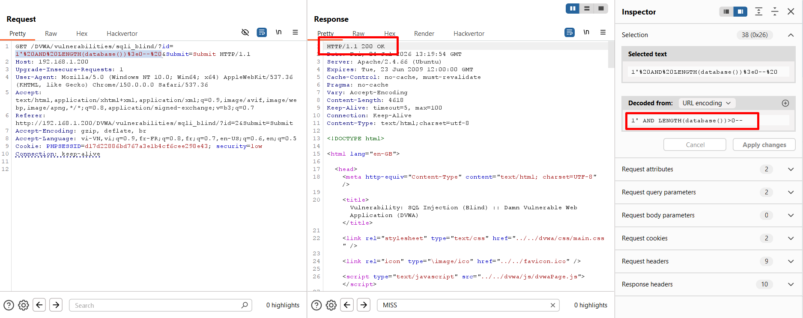

- Đầu tiên ta kiếm trá trường hợp `>0` bằng payload 

```sql
1' AND LENGTH(database())>0-- 
```

- Kết quả cho ta thấy dược web trả về statuscode `200` và chuỗi `User ID exists in the database.`

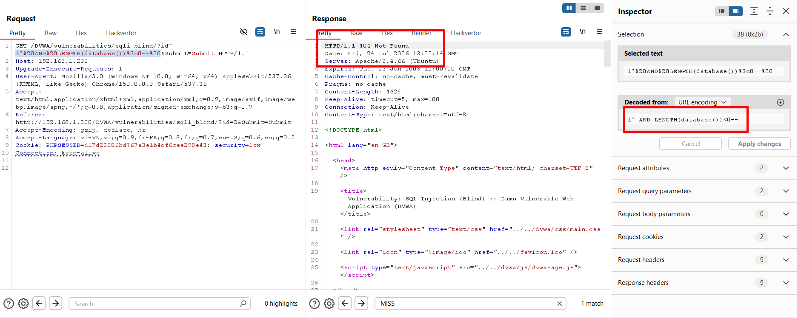

- Đến đây ta đã thấy được sự khác biệt trong response
- Nếu mệnh đề đúng, nó sẽ trả về `200`, nếu sai nó sẽ trả về `404`
- Tiếp theo ta sẽ thực hiện dò độ dài tên của DB hiện tại 

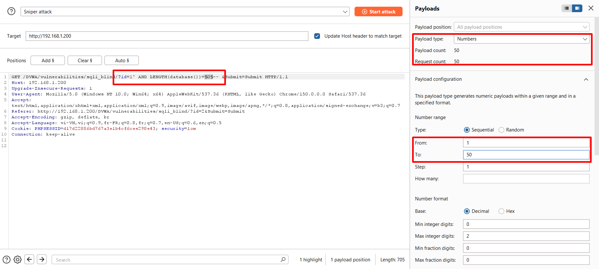

- Chuyển request hiện tại sang **Intruder**, ta chuyển tham số id từ dạng HTML encode sang dạng bình thường để có thể đọc và chỉnh sửa cho dễ hơn 
- Ta chuyển dấu > sang dấu = để so sánh
- **Payload type**: `Numbers`, ta ước lượng độ dài của tên DB sẽ `<50` nên để brute-force chạy từ `1` đến `50`
- Cuối cùng ta thực hiện việc chuyển lại dạng **URL encode** (*kể từ request sau thì mặc định trước khi gửi đi ta sẽ phải chuyển sang dạng HTML encode*)

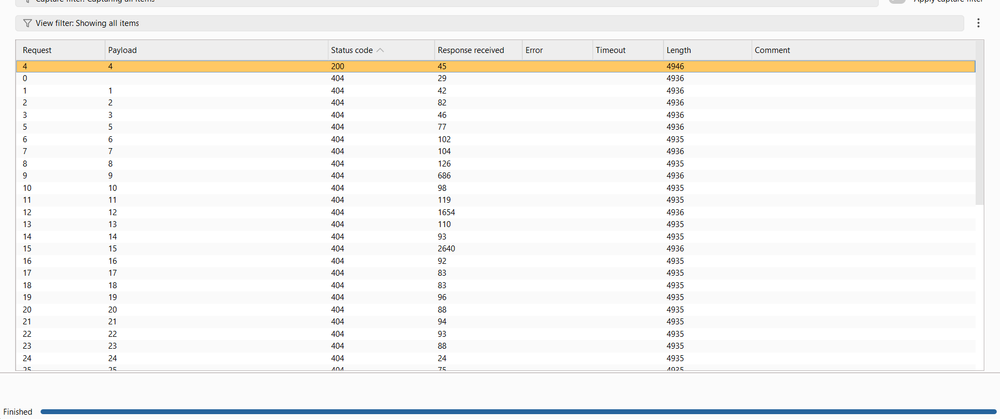

- Sau khi thực hiện brute-force, ta nhận dược duy nhất 1 response có statuscodee là `200`, từ đó suy ra được độ dài tên của DB là `4`
- Tiếp theo ta sẽ thực hiện brute-force để tìm ra tên của DB bằng payload 

```sql
1' AND SUBSTRING(database(),1,1)='a'-- 
```

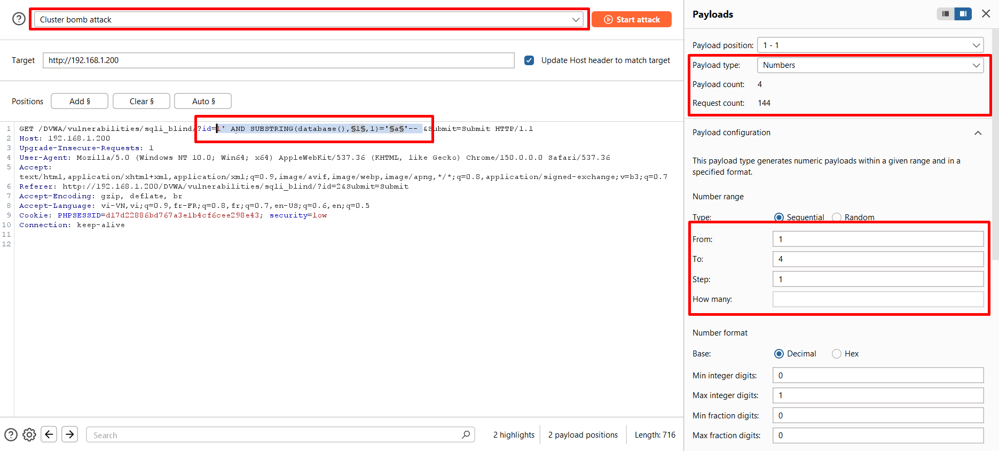

- Với payload này ta sẽ sử dụng `Cluster Bomb Attack` với 2 vị trí như trong hình
- Do tên DB có 4 kí tự, vì vậy vị trí thứ nhất sẽ chạy từ `1` đến `4`

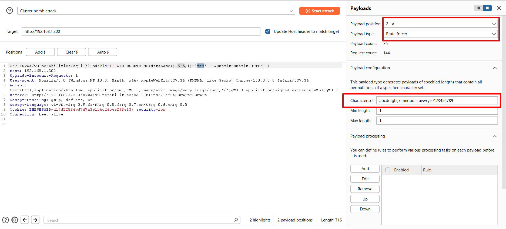

- Ở vị trí thứ 2 ta sẽ thực hiện brute-force từng kí tự một

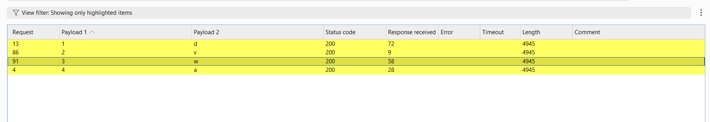

- Sau khi brute-force, ta được tên của DB là     `dvwa`
- Tiếp theo ta sẽ, thực hiện lấy tên của tất cả các bảng trong DB

```sql
1' AND LENGTH((SELECT group_concat(table_name) FROM information_schema.tables WHERE table_schema='dvwa'))=0-- 
```

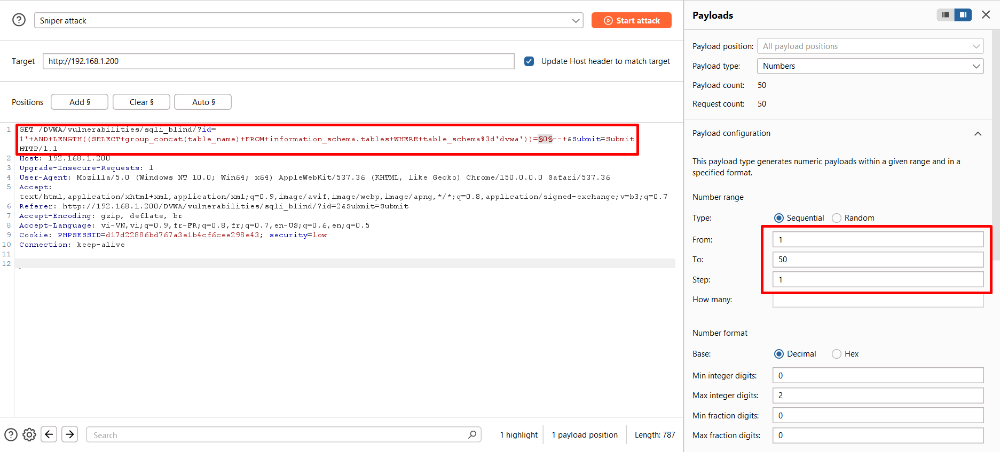

- Ta tiếp tục thực hiện tìm độ dài của chuỗi

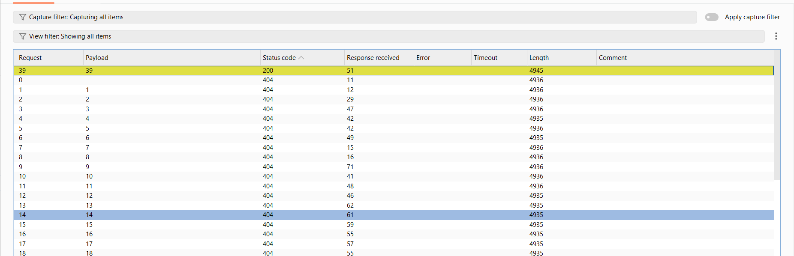

- Ta nhận được kết quả và độ dài chuỗi là `39`
- Tiếp theo là lấy cả chuỗi đó

```sql
1' AND SUBSTRING((SELECT group_concat(table_name) FROM information_schema.tables WHERE table_schema='dvwa'),1,1)='a'-- 
```

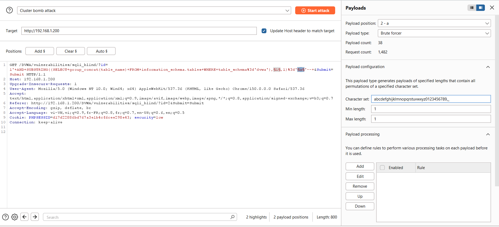

- Tiếp tục là thực hiện setup payload

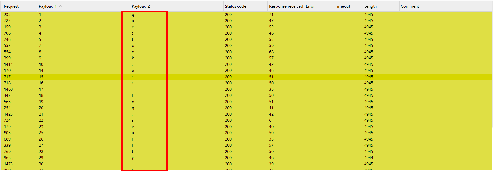

- Kết quả là ta nhận được `4` bảng là `guestbook`,`access_log`,`security_log`,`users`
- Bảng chứa thông tin của người dùng khả năng cao là bảng `users`
- Vậy nên ta sẽ thực hiện lấy tên tất cả các cột trong bảng `users`    

```sql
1' AND SUBSTRING((SELECT group_concat(column_name) FROM information_schema.columns WHERE table_name='users'),1,1)='a'-- 
```

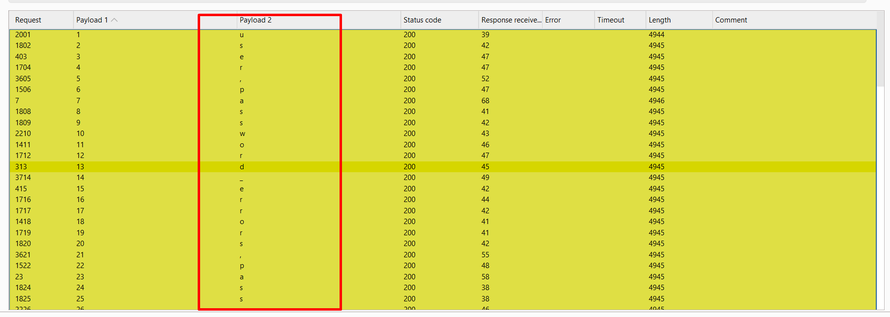

- Sau khi chạy, ta thu được các cột `user_id`,`first_name`,`last_name`,`user`,`password`,`avatar`,`last_login`,`failed_login`,`role`,`account_enabled`
- Các cột ta chú ý là `user` và `password`, ta tiến hành lấy dữ liệu từ 2 cột này

```sql
1' AND SUBSTRING((SELECT group_concat(CONCAT(user, ',', password) SEPARATOR ' | ') FROM users),1,1)='a'-- 
```

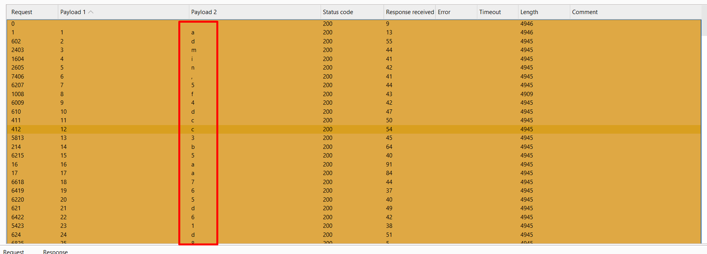

- Từ đây ta có thểm dump hết tất cả thông tin của người dùng 

#### **Phân tích mã nguồn**
```php

<?php

if( isset( $_GET[ 'Submit' ] ) ) {
    // Get input
    $id = $_GET[ 'id' ];
    $exists = false;

    switch ($_DVWA['SQLI_DB']) {
        case MYSQL:
            // Check database
            $query  = "SELECT first_name, last_name FROM users WHERE user_id = '$id';";
            try {
                $result = mysqli_query($GLOBALS["___mysqli_ston"],  $query ); // Removed 'or die' to suppress mysql errors
            } catch (Exception $e) {
                print "There was an error.";
                exit;
            }

            $exists = false;
            if ($result !== false) {
                try {
                    $exists = (mysqli_num_rows( $result ) > 0);
                } catch(Exception $e) {
                    $exists = false;
                }
            }
            ((is_null($___mysqli_res = mysqli_close($GLOBALS["___mysqli_ston"]))) ? false : $___mysqli_res);
            break;
        case SQLITE:
            global $sqlite_db_connection;

            $query  = "SELECT first_name, last_name FROM users WHERE user_id = '$id';";
            try {
                $results = $sqlite_db_connection->query($query);
                $row = $results->fetchArray();
                $exists = $row !== false;
            } catch(Exception $e) {
                $exists = false;
            }

            break;
    }

    if ($exists) {
        // Feedback for end user
        echo '<pre>User ID exists in the database.</pre>';
    } else {
        // User wasn't found, so the page wasn't!
        header( $_SERVER[ 'SERVER_PROTOCOL' ] . ' 404 Not Found' );

        // Feedback for end user
        echo '<pre>User ID is MISSING from the database.</pre>';
    }

}

?>
```

- Ta thấy được rằng logic khá giống [SQLi](https://github.com/ngngocatr/dvwa-lab/tree/master/vulnerabilities/3.SQL%20Injection) bình thường nhưng chỉ thêm biến `$exists` để so sánh logic để in ra `User ID exists in the database.` hoặc `User ID is MISSING from the database.`

Vì lỗ hổng này cách khai thác cũng gần giống với SQLi thông thường nên các mức độ tiếp theo cũng tương tư như [SQLi](https://github.com/ngngocatr/dvwa-lab/tree/master/vulnerabilities/3.SQL%20Injection)


